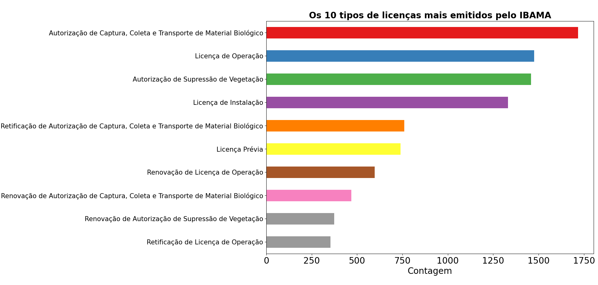
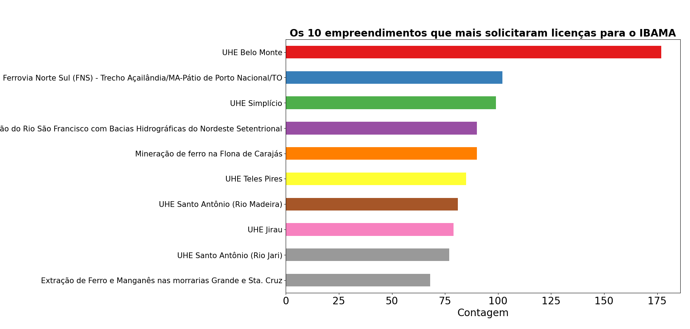
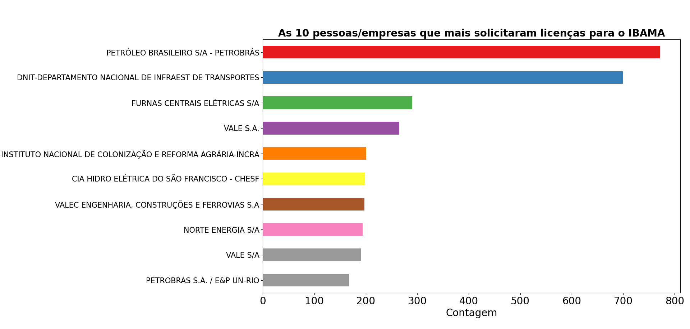
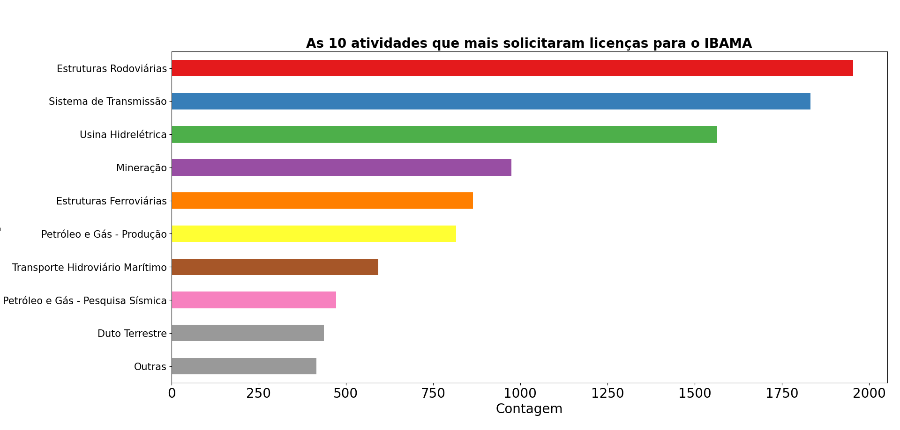
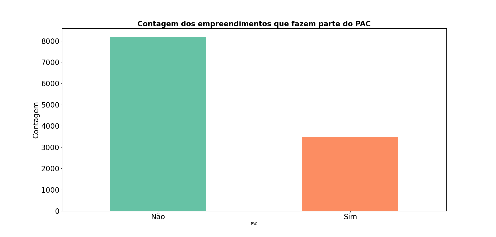

# Análise de dados das licencas ambientais emitidas pelo IBAMA

## Introdução

O licenciamento ambiental é um mecanismo criado pela política nacional do meio ambiente (PNMA) cujo objetivo é agir preventivamente sobre a proteção do bem comum do povo – o meio ambiente – e compatibilizar sua preservação com o desenvolvimento econômico-social. Com isso, houve uma necessidade dos orgão ambientais criar mecanismos para ter um certo controle na hora de emitir todo o tipo de licença, e então teve uma ideia para registrar todo o tipo de licença emitida para determinada atividade, empreendimento, dono, etc. Como todos os registros, criou-se uma planilha com todos os registro referentes a atribuição do orgão ambiental competente que, nesse caso, refere-se ao IBAMA.

## Análise geral

Com os dados dos registros, é perfeitamente possivel fazer uma análise deles, usando as ferramentas certas para tal trabalho. Para isso,utilizou-se a linguagem de programação <b>python</b>, juntamente com o ambiente virtual <b>jupyter notebook</b>, e as bibliotecas do python <b>pandas</b> e <b>matplotlib</b> para a manipulação dos dados e geração dos gráficos, respectivamente. Então veremos os resultados abaixo:

### Tipos de licenças emitidas pelo IBAMA

Fonte: Arquivo pessoal (2023)
 

### Empreendimentos

Fonte: Arquivo pessoal (2023)
 

### Empresas

Fonte: Arquivo pessoal (2023)
 

### Atividades dos empreendimentos 

Fonte: Arquivo pessoal (2023)
 

### Empreendimentos que participaram do PAC

Fonte: Arquivo pessoal (2023)
 

## Conclusão

Percebe-se que, com uma simples análise dos dados e sua manipulação correta, é capaz de gerar gráficos a pontos de entender todo panorama geral de licenciamento ambiental feito pelo IBAMA, por exemplo. Sem contar que abre um leque de possibilidade para fazer análise mais aprofundadas ou procurar informações relevantes que ajude a elucidar algum tipo de problema. Para saber como eu fiz esses gráficos, basta acessar o <a href="https://github.com/fernandessfae/licencas_ambientais_ibama/blob/master/analise_dados_IBAMA.ipynb">notebook</a> presente nesse repositório. Já para entender toda uma análise completa a questão do licenciamento ambiental e as informações relevantes sobre esses dados do IBAMA, basta acessar meu <a href="https://medium.com/@aristotelesfernandes11/an%C3%A1lise-de-dados-das-licen%C3%A7as-ambientais-de-atividades-e-empreendimentos-licenciados-pelo-ibama-599d92015594">artigo</a> no medium.
